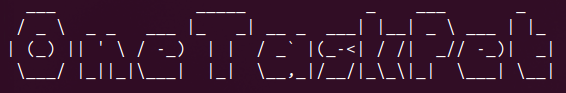

# OneTaskPet

[](http://forthebadge.com)
[](http://forthebadge.com)

OneTaskPet — это программа, которая помогает сосредоточиться на задачах. Если вы не успеваете выполнить задачу в срок, она автоматически переносится на следующий день. То же самое происходит с последующими задачами, которые были запланированы. Также в программе есть питомец, которого нужно кормить выполненными задачами. Данная программа выполнена в консоли
 
  

# Главы

- [Использование](#Использование)
- [Установка](#Установка)
- [Обновление](#Обновление)
- [Деинсталяция](#Деинсталяция)
- [Планы по разработке](#Планы-по-разработке)
- [License](#license)

# Использование

[(Back to top)](#Главы)

Man pages have been added. Checkout `man colorls`.

# Установка

[(Back to top)](#Главы)

1. Install Ruby (preferably, version >= 2.6)
2. [Download](https://www.nerdfonts.com/font-downloads) and install a Nerd Font. Have a look at the [Nerd Font README](https://github.com/ryanoasis/nerd-fonts/blob/master/readme.md) for installation instructions.

    *Note for `iTerm2` users - Please enable the Nerd Font at iTerm2 > Preferences > Profiles > Text > Non-ASCII font > Hack Regular Nerd Font Complete.*

    *Note for `HyperJS` users - Please add `"Hack Nerd Font"` Font as an option to `fontFamily` in your `~/.hyper.js` file.*

3. Install the [colorls](https://rubygems.org/gems/colorls/) ruby gem with `gem install colorls`

    *Note for `rbenv` users - In case of load error when using `lc`, please try the below patch.*

    ```sh
    rbenv rehash
    rehash
    ```

4. Enable tab completion for flags by entering following line to your shell configuration file (`~/.bashrc` or `~/.zshrc`) :
    ```bash
    source $(dirname $(gem which colorls))/tab_complete.sh
    ```

5. Start using `colorls` :tada:

6. Have a look at [Recommended configurations](#recommended-configurations) and [Custom configurations](#custom-configurations).

# Обновление

[(Back to top)](#Главы)

Want to update to the latest version of `colorls`?

```sh
gem update colorls
```

# Деинсталяция

[(Back to top)](#Главы)

Want to uninstall and revert back to the old style? No issues (sob). Please feel free to open an issue regarding how we can enhance `colorls`.

```sh
gem uninstall colorls
```

# Планы по разработке

[(Back to top)](#Главы)

- [X] Сделать класс для отрисовки меню
- [X] Отредактировать класс так, чтоб текст меню распологался по центру меню
- [ ] Разработка класса для хранения информации о задаче (время, дата на которую назначенна задача) (в разработке). Там должны быть функции для запуска работы, пауза, остановка
- [ ] Сделать меню для установки задач на текущий день. Все запланированные задачи должны хранится в файле. Из этой меню можно выполнить задачи на текущий день, выбрав их из меню, отметить их выполненными.
- [ ] Доделать список задач

# License

[(Back to top)](#Главы)

GNU GENERAL PUBLIC LICENSE
Version 3, 29 June 2007

Copyright (C) 2007 Free Software Foundation, Inc. <https://fsf.org/>
Everyone is permitted to copy and distribute verbatim copies
of this license document, but changing it is not allowed.